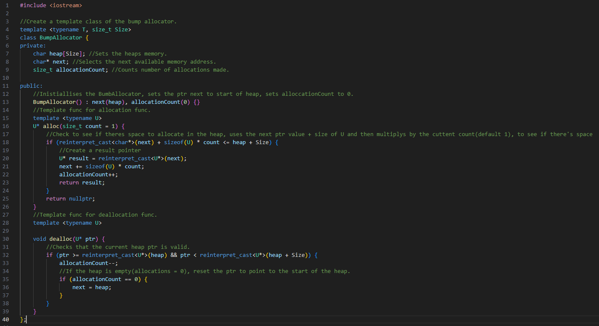

# Worksheet Two

## Task One

For this task we had to make a bump allocator that has and allocate and deallocate functions and provide 3 different examples
of it running. 

To implement this I first created a template class called BumpAllocator, by using a template it allowed me to re-use
the code of the bump allocator for multiple tasks, and defined the variables needed as private, these were the heap, a pointer to the memory
and a counter for allocatedMemory. I then created the alloc function, this uses a template parameter U, this parameter represents
the data to be added to the heap, it then attempts to add what is currently stored within the U parameter by checking if there
is space for it on the heap, calculated by using the next ptr value + size of U and then multiplys by the cuttent count(default 1),
if there is space for on the heap it is then added and the ptr next moves to the next free space ready for the next value to be added,
if there isn't space it returns a nullptr.

Deallocate uses the same template parameter U to identify what object is to be removed, the function is fed both the U parameter and
a ptr argument to represent the memory location, it then uses these two arguments to first check that the ptr is in range of the heaps
memory, to see if it vaild to be deallocated, it then deincrements the allocation count to show that the memory space has been
deallocated, in the case that the allocationCount reaches 0 it resets the postion of the next ptr variable to the start of the heaps
memory.

The following image shows the code used within the main function, the code is used to show 3 examples, these being allocating 3 different
sizes of objects, the allocation returning a nullptr and the allocator reseting when deallocations are equal to the number of allocations.

