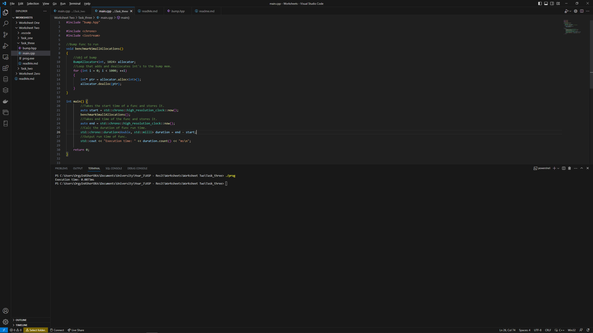
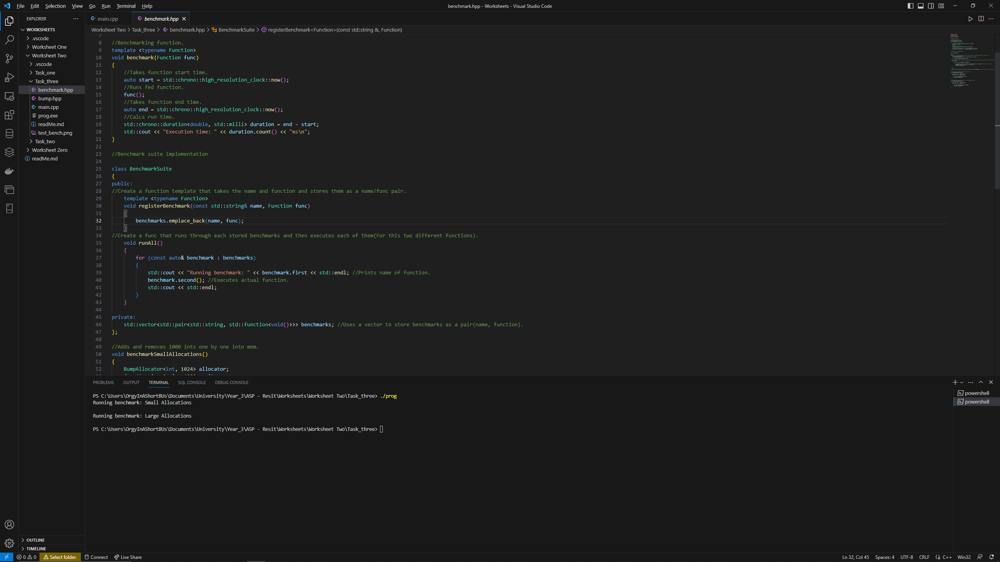

# Task Three

To run this code please use clang++ main.cpp -o prog
Then ./prog to run the compiled program

## Part One - Always Bump Down / Benchmarking function

reading the blog [Always Bump Downwards](https://fitzgeraldnick.com/2019/11/01/always-bump-downwards.html) I can tell that the bump allocator I have implemented is currently bumping upwards,
this is because it counts the number of allocations made incremently to when new mem objs are added to it.

To test the non optimised bump allocator used for the previous taks I decided to create a simple function that add/removes 1000 items from the bump's memory, then within the main function using elements from the chrono libray took
the start and end time of the function running and used them to see how long it took the function to complete running.

## Part Two - Benchmarking Suite

After testing how to use the chrono libary I moved on to creating the benchmarking suite, to do this I created a .hpp file for the whole benchmarking program, to begin with I turned what I had used in the main func above into
a template function within the hpp, this allows for it to be used repeatedly throughout the rest of the program, this function takes the argument of func which is a function type and used it to run the desired function and 
calculate the runtime of said function.
Then I implemented the benchmarking suite class, this involved creating the class and then defining the public and private memebers within it,
the first public member takes the function and stores them in the benchmarks vector as a name function pair, doing this made it easier for me to
show which function was currently running when testing. The next memeber was the runAll() func, this runs a loop that goes through
the stored benchmarks prints the name of which is running and then executes the function paired with that name. The private member is the 
vector pairings related to benchmarks.

The final change to this .hpp was moving the first test func and created a second one that stores multiple values at once rather then one at a time.

The next changes were to the main.cpp file, here I removed all the previous code and make an obj of benchmarkingsuite, then using this obj called
the registerBenchmark() func for each test function I wanted to run, giving a name and the function name, then finally use the runAll()
to test the program.

The program runs however it doesn't show how long it takes to execute each function.
