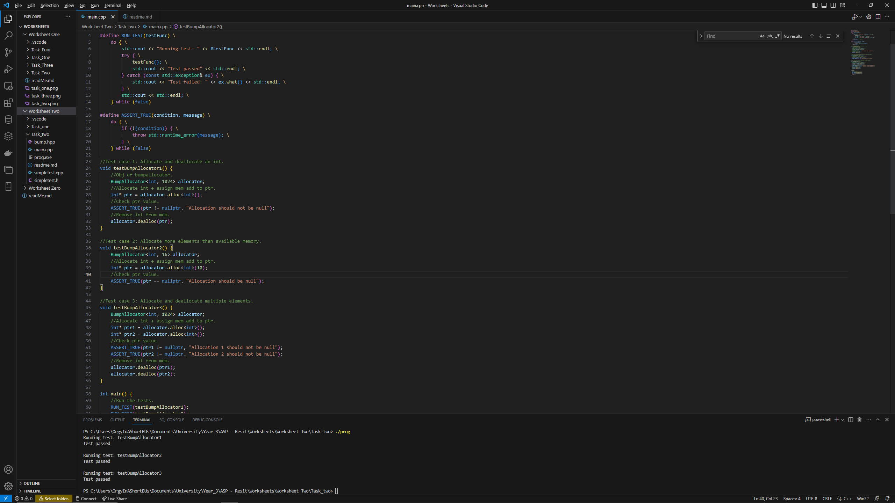

# Worksheet Two

## Task Two
To create the unit tests I first downloaded the contents of the simpletest directory found at https://github.com/kudaba/simpletest/tree/b528a7a43179e341a9b1f71b7cdcb0c5f9655080 and included it 
within the task folder, after including it within the main.cpp file I had to define two of the testing functions to allow me to use them.
The first function I defined is the RUN_TEST function, this is what executes each of my tests, it does this by running which ever testing
func that is being fed to it, telling the user which test is being running and then checking to see if the tests throws an error,
if the test func gives and error it says the test fails else it says it passed, by including while(false) it prevents it from running the same
test func indefinatly.
The second function I defined was ASSERT_TRUE, this func takes the condition and message arguments, these are the condition to be checked
and the message to be given if the condition isn't met, it then checks to see if the condition is met, if it isn't the program
throws the error message assosiated with the test else nothing happens meaning the test was succesful.

Test case 1 checks to see if an int value can be allocoated and deallocated, it does this by assigning an int with alloc and then
assigns the memory address of that into to a ptr, it then checks that the memory address of the ptr isn't null, if it is null it throws an
error, then the it deallocates the memory using dealloc.

Test case 2 checks to see that bump allocator handles someone trying to add more data into the memory then it has space for, to do this
I created an obj of BumpAllocator setting the memory size to 16, then it attempts to add 10 integers into the memory, as the memory only has 16 bytes available and each
int requires 2 bytes there isn't space, and assigns the memory address to a ptr, the program then checks that ptr's value is null, if it isn't 
it gives an error else the test succesful.

Test case 3 checks that the bump can handle adding and removing multiple elements, to do this again an obj is made of the BumpAllocator then as before
two different int values are allocated to it both using different ptrs, then the program checks that the ptr value isn't null, if the values aren't null
it then removes them both from the bump stack.

