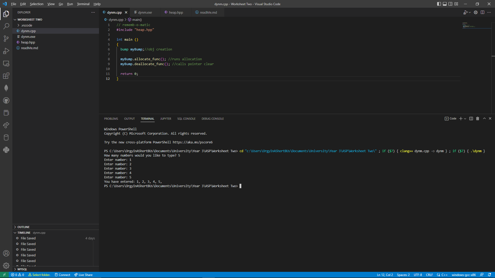
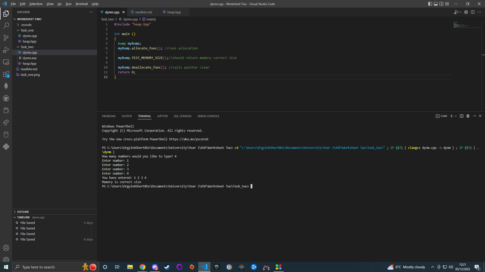

# Worksheet Two

# Task One
For this we had to create a bump allocator that would allocate data into memory and return an error if it couldn't allocate it, we had to include both an
allocate function and a deallocate function, one to add to the memory and one to clear it. To do this I used a simple class of which contained a simple constructor
and destructor, along with this were the two functions required.

The allocate function creates the memory storage based on what the user set it to and then stores date, which is also inputed by the user, once the storage is full it returns
a nullptr and then stops requesting input, the deallocate function is then called to clear the storage using delete.

The image shows the allocate function successfully adding the data into the memory.

--------------------------------------------------------------------------------------

## Task Two
For this we had to implement unit test that can be used to test our bump allocation program we created in task one,
the first test I implemented was that the correct amount of the user decided to allocated was the amount the program allocated, to do this a simple
fucntion was created that took the size of the stored data and divided it by the byte value of an int, this was then stored as a seprate value and
used to figure out if the correct amount of memory assigned was correct or not.

