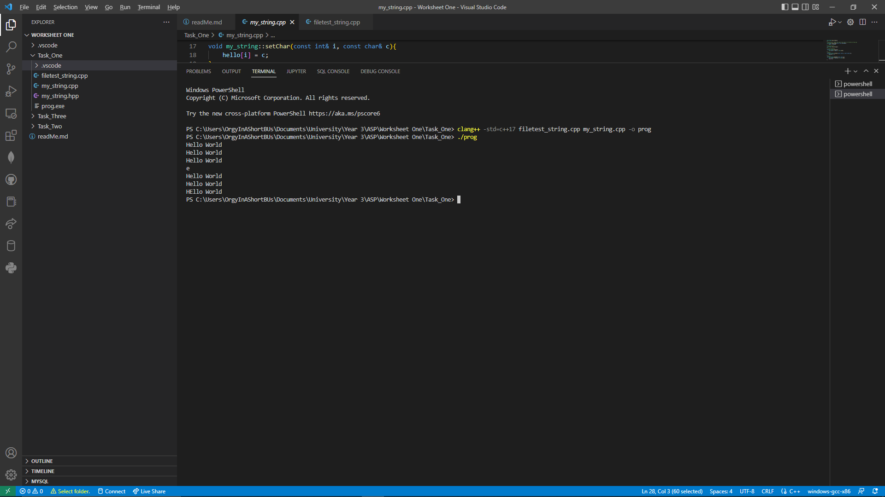
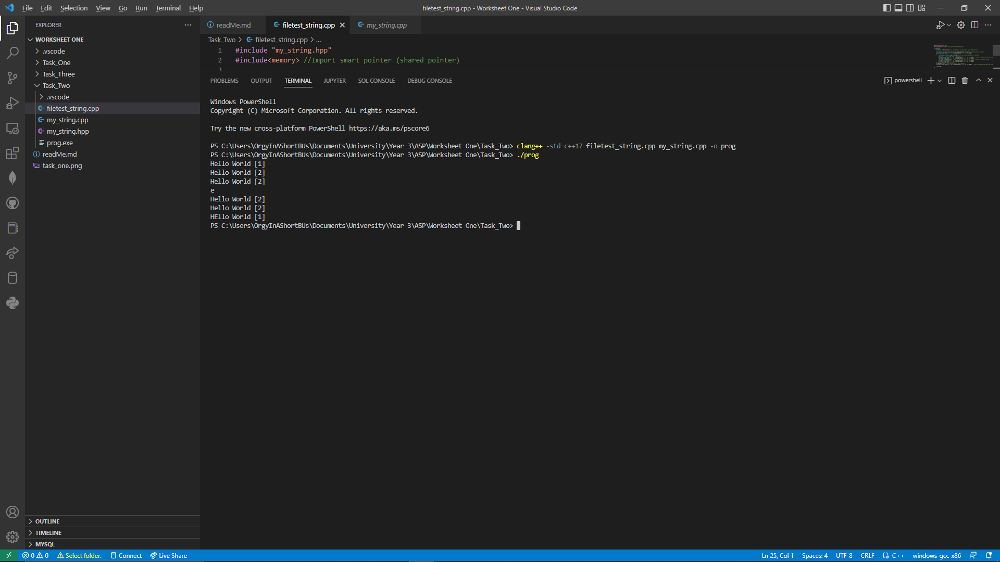
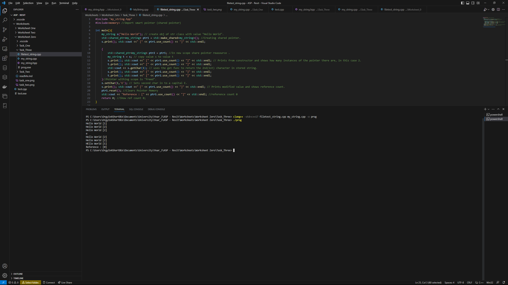

# Worksheet One

## Task One

For this task we had to implement a simple class in a .hpp file, we had to implement a constructor class, a copy constructor, a deconstructor, an operator assignment
overload and three functions, print get setChar. The functions were simple to implement, the print function takes the stored
variable within the string class and prints it, the set character uses the stored variable and sets i, gained from the filetest_string,
and changes the character in that postion to an new character gained from the same line of code, the getChar works in a similar way
by getting i from the hello variable and returning it for use.
The constructor takes 'Hello World' from line 4 in the filetest_string.cpp and copys it to the private variable hello.
The deconstructor used is the default constructor that cpp provides.
The copy constructor clears the current value and then replaces it with the same value, this allows the program to make changes to one whilst keeping the other the same,
this allows there to be two different outputs from the same variable name depending on what obj instance is called, in this case either s or t.

## Task Two

For this task I used a shared pointer to do the reference counting, I extended the .print() commands to inclued another print that
returns the current count of the pointer in an easy to read format, that the prints outside of the inside scope only have a reference count of 
1 whilst the ones on the inside scope have a reference count of 2, this is due to the inside scope having 2 obj's, s and t. that call the class
where as the outside scope only has the 1.

## Task Three

By using reset() on ptr1 and then calling re-calling with .use_count() it returns a reference count of 0, this is because the .reset() replaces the ptr1 variable with
what the object the pointer is currently pointing at, as this is outside of the main function the pointer is pointing at zero so when 
the reference count is called it returns 0.

